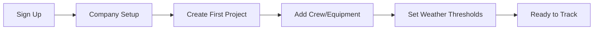
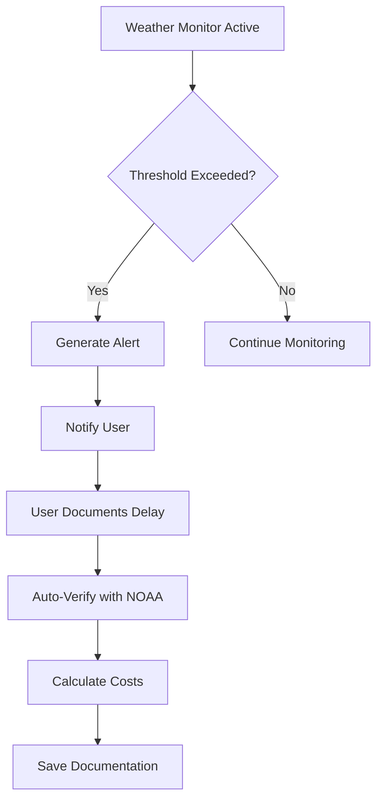

# WeatherProof Features & Workflows Guide

## Core Features Overview

### 1. Project Management
- Create and manage construction projects
- Track project details, crew, and equipment
- Monitor weather impacts in real-time
- Calculate delay costs automatically

### 2. Weather Delay Documentation
- Document weather-related work stoppages
- Automatic NOAA weather verification
- Photo documentation support
- Cost calculation (labor, equipment, overhead)

### 3. Insurance Claim Generation
- Generate professional PDF reports
- ACORD form compatibility
- Include verified weather data
- Digital signature support

### 4. Analytics & Insights
- Dashboard with real-time metrics
- Weather pattern analysis
- Cost impact tracking
- Project performance metrics

## Key Workflows

### 1. Initial Setup Workflow

**Steps:**
1. **Sign Up**: Create account with email/password
2. **Company Setup**: Add company details, insurance info
3. **Create Project**: 
   - Project name and address
   - Start/end dates
   - Crew size and hourly rates
   - Insurance carrier details
4. **Add Resources**:
   - Import or add crew members
   - Add equipment with rates
   - Assign to projects
5. **Configure Thresholds**:
   - Wind speed limits
   - Temperature ranges
   - Precipitation thresholds

### 2. Daily Weather Monitoring Workflow

**Automatic Process:**
- Weather data collected every hour
- Thresholds checked against project settings
- Alerts generated for violations
- Push notifications sent (if enabled)

**Manual Documentation:**
1. Click "Document Delay" from alert or dashboard
2. Select project and enter details
3. Add photos of site conditions
4. System auto-fetches NOAA data
5. Review calculated costs
6. Save documentation

### 3. Insurance Claim Workflow

**Detailed Steps:**

1. **Review Documented Delays**
   - Dashboard shows "Ready to Claim" section
   - Delays grouped by project
   - Total claimable amount displayed

2. **Generate Insurance Report**
   - Click "Generate Claim" for project
   - Select date range and delays
   - Choose report format:
     - Detailed (all supporting data)
     - Summary (executive overview)
     - ACORD forms

3. **Report Contents**
   - Executive summary
   - Verified weather data
   - Detailed cost breakdowns
   - Photo documentation
   - NOAA verification links
   - Digital signatures

4. **Submit to Insurance**
   - Download PDF report
   - Email directly from system
   - Track submission status
   - Store claim number

### 4. Bulk Data Management Workflow

**Import Process:**
1. Download CSV template
2. Fill with your data
3. Upload via import modal
4. Review and confirm
5. System validates and imports

**Export Process:**
1. Select data type
2. Choose filters/date range
3. Generate CSV
4. Download file

**Supported Data Types:**
- Projects
- Crew Members
- Equipment
- Delay Events
- Weather Data

### 5. Report Generation Workflow

**Available Reports:**

1. **Daily Weather Log**
   - Weather conditions by hour
   - Work status indicators
   - Threshold violations
   - Crew present

2. **Delay Notification**
   - Single delay event
   - Immediate notification format
   - For project managers/clients

3. **Insurance Claim**
   - Multiple delays
   - Comprehensive documentation
   - Cost justification
   - Weather verification

4. **Executive Summary**
   - High-level overview
   - Total impact metrics
   - Trend analysis
   - Recommendations

**Generation Process:**
1. Navigate to Reports section
2. Select report type
3. Choose project and date range
4. Configure options
5. Generate and preview
6. Download or email

## User Roles & Permissions

### Account Owner
- Full system access
- Manage all projects
- View all reports
- Configure company settings
- Manage team members

### Project Manager
- Assigned project access
- Document delays
- Generate reports
- View analytics

### Field Supervisor
- Document delays
- Upload photos
- View weather alerts
- Update daily logs

## Dashboard Sections

### 1. Overview Cards
- **Active Projects**: Current project count
- **Weather Delays**: Last 30 days
- **Hours Lost**: Labor impact
- **Cost Impact**: Financial summary

### 2. Insurance Claim Status
- **Active Delays**: Currently happening
- **Ready to Claim**: Documented and verified
- **Generated Reports**: Completed claims

### 3. Recent Alerts
- Weather warnings
- Threshold violations
- System notifications
- Sorted by severity

### 4. Weather Conditions
- Latest readings
- Risk indicators
- By project location

### 5. Project List
- Active projects
- Delay status
- Cost summary
- Quick actions

## Mobile Workflows

### Field Documentation
1. Open mobile browser
2. Login to WeatherProof
3. Tap "Document Delay"
4. Take photos directly
5. Submit from field

### Quick Actions
- Start/stop delays
- Upload photos
- Check weather
- View alerts

## Settings & Configuration

### Company Settings
- Company information
- Default rates
- Logo upload
- Tax/license info

### Weather Thresholds
- Use templates or custom
- Per-project overrides
- Work type specific
- Save as templates

### Notifications
- Email alerts
- SMS (coming soon)
- Daily summaries
- Critical only mode

### API Integrations
- NOAA configuration
- Webhook setup
- External system keys

## Best Practices

### Daily Operations
1. Check dashboard each morning
2. Review weather forecasts
3. Document delays immediately
4. Upload photos same day
5. Verify costs weekly

### Monthly Tasks
1. Generate monthly reports
2. Submit insurance claims
3. Review analytics
4. Update crew/equipment
5. Audit delay documentation

### Project Setup
1. Accurate location (for weather)
2. Correct insurance details
3. Realistic thresholds
4. Complete crew roster
5. Equipment assignments

## Troubleshooting Workflows

### Delay Not Calculating Costs
1. Check crew size is set
2. Verify hourly rates
3. Ensure end time is entered
4. Review overhead settings

### Weather Data Missing
1. Verify project location
2. Check NOAA service status
3. Try manual refresh
4. Contact support if persists

### Report Generation Fails
1. Ensure delays are verified
2. Check date range has data
3. Verify all required fields
4. Try smaller date range

### Can't Submit Forms
1. Check all required fields
2. Verify RLS permissions
3. Ensure active session
4. Clear browser cache

## Tips for Success

1. **Document Immediately**: Don't wait to document delays
2. **Take Photos**: Visual evidence strengthens claims
3. **Be Specific**: Detailed descriptions help claims
4. **Regular Reviews**: Check documentation weekly
5. **Threshold Tuning**: Adjust based on experience
6. **Team Training**: Ensure all users understand workflows
7. **Backup Data**: Regular CSV exports
8. **Stay Current**: Keep project info updated

## Support Resources

- In-app help tooltips
- Video tutorials (coming soon)
- Email support
- Documentation updates
- Feature requests via GitHub