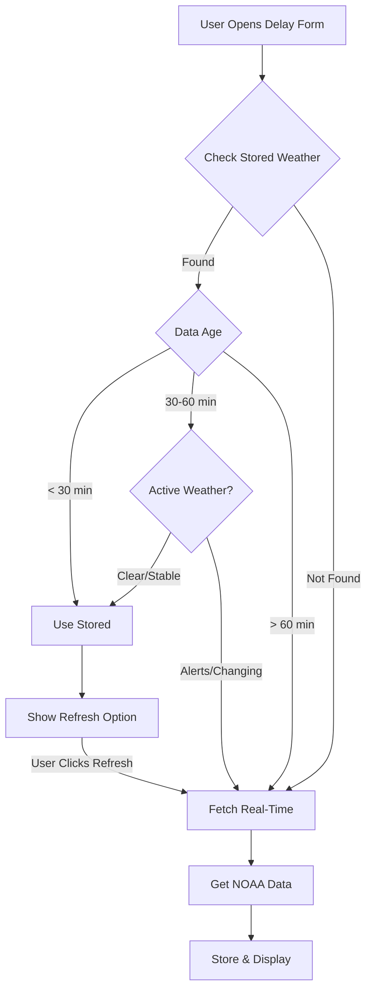

# Real-Time Weather Check Scenarios

## When Users Need Real-Time Weather

### 1. **Morning Safety Decisions** (6 AM)
```typescript
// Scenario: Foreman checking if crew should report
"Last night's forecast said clear, but I see dark clouds. 
Should I send the crew home or have them report?"

// Real-time check shows:
- Thunderstorm developed overnight
- Lightning risk at 8 AM
- Decision: Delay start by 2 hours
```

### 2. **Documenting Current Delays** (Live)
```typescript
// Scenario: Rain just started, documenting in real-time
"It's 10:47 AM and rain just started. I'm sending crews home now."

// Need current conditions for accuracy:
- Exact time rain started
- Current intensity
- Wind speeds RIGHT NOW (for crane decisions)
```

### 3. **Data Gap Scenarios**
```typescript
// Your automated collection might miss:
- Collection job failed at 10:00 AM
- Internet was down at project site
- New project just added (no history yet)
- User documenting for different project location
```

### 4. **Rapid Weather Changes**
```typescript
// Texas afternoon thunderstorms:
10:00 AM: Clear, 85°F
10:30 AM: (No collection scheduled)
10:45 AM: Sudden thunderstorm develops
11:00 AM: Next scheduled collection

// 45-minute gap misses critical change
```

## Implementation Strategy

### 1. **Hybrid Approach**
```typescript
interface WeatherDataSource {
  // Check stored data first
  stored: ProjectWeather | null
  storedAge: number // minutes
  
  // Offer real-time if:
  needsRealTime: boolean
  reason: 'data_gap' | 'stale_data' | 'user_request' | 'rapid_change'
}

async function getWeatherForDelay(projectId: string, timestamp: Date) {
  // 1. Check stored data
  const stored = await getStoredWeather(projectId, timestamp)
  
  // 2. Evaluate if real-time needed
  if (!stored) {
    return { needsRealTime: true, reason: 'data_gap' }
  }
  
  const ageMinutes = (Date.now() - stored.collected_at) / 60000
  
  if (ageMinutes > 45) {
    return { needsRealTime: true, reason: 'stale_data' }
  }
  
  // 3. Check for weather alerts since last collection
  const hasNewAlerts = await checkForNewAlerts(projectId, stored.collected_at)
  if (hasNewAlerts) {
    return { needsRealTime: true, reason: 'rapid_change' }
  }
  
  return { stored, needsRealTime: false }
}
```

### 2. **Smart UI Integration**
```typescript
// In delay documentation form
export function WeatherSection({ projectId, date, time }) {
  const [weather, setWeather] = useState(null)
  const [dataSource, setDataSource] = useState<'stored' | 'loading' | 'realtime'>()
  
  useEffect(() => {
    checkWeatherData()
  }, [date, time])
  
  const checkWeatherData = async () => {
    const result = await getWeatherForDelay(projectId, date, time)
    
    if (result.needsRealTime) {
      // Show prompt to user
      showWeatherPrompt(result.reason)
    } else {
      setWeather(result.stored)
      setDataSource('stored')
    }
  }
  
  return (
    <div>
      {/* Stored weather display */}
      {weather && (
        <WeatherDisplay 
          data={weather} 
          source={dataSource}
          age={getDataAge(weather.collected_at)}
        />
      )}
      
      {/* Real-time option */}
      <Button 
        variant="outline" 
        onClick={fetchRealtimeWeather}
        className="mt-2"
      >
        <RefreshCw className="w-4 h-4 mr-2" />
        Get Current Weather
        {weather && <span className="text-xs ml-2">
          (Last updated {getDataAge(weather.collected_at)} ago)
        </span>}
      </Button>
      
      {/* Explanation when needed */}
      {dataSource === 'realtime' && (
        <Alert>
          <AlertCircle className="h-4 w-4" />
          <AlertDescription>
            Using real-time weather data because {getReason(result.reason)}
          </AlertDescription>
        </Alert>
      )}
    </div>
  )
}
```

### 3. **Real-Time Fetch Function**
```typescript
async function fetchRealtimeWeather(projectId: string) {
  const project = await getProject(projectId)
  
  // Check if we have cached grid coordinates
  if (project.cached_grid_id) {
    // Fast path - direct to forecast
    const weather = await fetchNOAAForecast(
      project.cached_grid_id,
      project.cached_grid_x,
      project.cached_grid_y
    )
    
    // Store for future use
    await storeWeatherData(projectId, weather, 'manual')
    
    return weather
  } else {
    // Slow path - need coordinates first
    const coords = await getGridCoordinates(project.latitude, project.longitude)
    await updateProjectGrid(projectId, coords)
    
    return fetchNOAAForecast(coords.gridId, coords.gridX, coords.gridY)
  }
}
```

### 4. **Decision Tree for Real-Time**


## User Experience Patterns

### 1. **Automatic with Manual Override**
```typescript
// Best for most users
- Show stored data by default
- Display data age prominently  
- One-click refresh always available
- Auto-refresh if data is stale
```

### 2. **Proactive Prompts**
```typescript
// When to prompt for real-time:
if (dataAge > 45 && userIsDocumentingNow()) {
  showPrompt("Weather data is 45 minutes old. Refresh for current conditions?")
}

if (hasActiveAlerts && dataAge > 15) {
  showPrompt("Active weather alerts. Get latest conditions?")
}

if (documentingPastDelay && noDataForTimeRange()) {
  showPrompt("No weather data for this time. Fetch historical weather?")
}
```

### 3. **Visual Indicators**
```typescript
// Data freshness indicator
<div className={cn(
  "flex items-center gap-2 text-sm",
  dataAge < 30 && "text-green-600",  // Fresh
  dataAge < 60 && "text-yellow-600", // Aging  
  dataAge >= 60 && "text-red-600"    // Stale
)}>
  <Clock className="w-4 h-4" />
  Updated {dataAge} minutes ago
  {dataAge > 45 && <Badge variant="outline">Refresh recommended</Badge>}
</div>
```

## Cost Optimization

### 1. **Cache Real-Time Fetches**
```typescript
// If user fetches real-time, store it
async function handleRealtimeFetch(projectId: string) {
  const weather = await fetchRealtimeWeather(projectId)
  
  // Store for this project
  await storeWeatherData(projectId, weather)
  
  // Check if other projects share this grid
  const sameGridProjects = await getProjectsBySameGrid(projectId)
  
  // Store for all projects in same grid (bonus efficiency)
  for (const otherProjectId of sameGridProjects) {
    await storeWeatherData(otherProjectId, weather)
  }
  
  return weather
}
```

### 2. **Rate Limiting**
```typescript
// Prevent abuse of real-time checks
const rateLimiter = {
  maxPerHour: 10,
  maxPerDay: 50,
  
  async checkLimit(userId: string) {
    const count = await getRealtimeCheckCount(userId, '1 hour')
    if (count >= this.maxPerHour) {
      throw new Error('Please wait before checking weather again')
    }
  }
}
```

## Summary

**Users need real-time weather for:**
1. **Safety decisions** - Morning go/no-go calls
2. **Live documentation** - Recording delays as they happen
3. **Data gaps** - System missed collections
4. **Rapid changes** - Storms developing between scheduled checks

**Best Practice:**
- Default to stored data (fast, free)
- Show data age clearly
- One-click real-time option
- Auto-prompt when data is stale or missing
- Cache real-time fetches for all projects