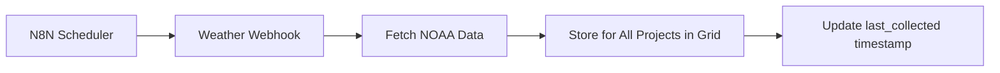
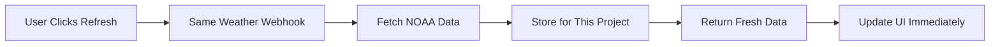

# Weather Webhook Implementation (Scheduled + Real-time)

## Single N8N Webhook for Both Use Cases

### 1. **Webhook Request Structure**
```typescript
interface WeatherWebhookRequest {
  // Required
  latitude: number
  longitude: number
  projectId: string
  
  // Optional cached grid data
  gridId?: string
  gridX?: number
  gridY?: number
  
  // Request type
  requestType: 'scheduled' | 'realtime'
  userId?: string // For real-time requests
  
  // What to fetch
  includeAlerts?: boolean
  includeHourly?: boolean
  includeObservations?: boolean
}
```

### 2. **N8N Webhook Flow**
```javascript
// In your n8n webhook
async function handleWeatherRequest(request) {
  const {
    latitude,
    longitude,
    projectId,
    gridId,
    gridX,
    gridY,
    requestType,
    userId
  } = request.body
  
  try {
    // Step 1: Get grid coordinates if not cached
    let grid = { gridId, gridX, gridY }
    if (!gridId) {
      const pointsData = await fetchNOAAPoints(latitude, longitude)
      grid = {
        gridId: pointsData.properties.gridId,
        gridX: pointsData.properties.gridX,
        gridY: pointsData.properties.gridY
      }
      
      // Cache for future use
      await updateProjectGrid(projectId, grid)
    }
    
    // Step 2: Fetch weather data
    const [forecast, alerts, observations] = await Promise.all([
      fetchHourlyForecast(grid),
      request.includeAlerts ? fetchActiveAlerts(latitude, longitude) : null,
      request.includeObservations ? fetchLatestObservation(grid) : null
    ])
    
    // Step 3: Process and store
    const weatherData = processNOAAData({
      forecast,
      alerts,
      observations,
      requestType,
      userId
    })
    
    // Step 4: Store in database
    if (requestType === 'scheduled' || request.storeRealtime) {
      await storeWeatherData({
        ...weatherData,
        project_id: projectId,
        data_source: requestType === 'realtime' ? 'realtime' : 'forecast',
        created_by: userId || null
      })
    }
    
    // Step 5: Check for other projects in same grid (efficiency)
    if (requestType === 'scheduled') {
      const nearbyProjects = await getProjectsInGrid(grid)
      for (const nearbyProject of nearbyProjects) {
        if (nearbyProject.id !== projectId) {
          await storeWeatherData({
            ...weatherData,
            project_id: nearbyProject.id
          })
        }
      }
    }
    
    return {
      success: true,
      data: weatherData,
      cached: requestType === 'scheduled' ? nearbyProjects.length : 1
    }
    
  } catch (error) {
    // Log error but don't fail completely
    await logWeatherError({
      projectId,
      error: error.message,
      requestType
    })
    
    return {
      success: false,
      error: error.message,
      fallback: await getLastKnownWeather(projectId)
    }
  }
}
```

### 3. **Frontend Implementation**
```typescript
// In n8n-helpers.ts
export async function fetchWeatherData(
  params: {
    projectId: string
    latitude: number
    longitude: number
    gridId?: string
    gridX?: number
    gridY?: number
  },
  options: {
    requestType: 'scheduled' | 'realtime'
    storeResult?: boolean
  } = { requestType: 'realtime', storeResult: true }
) {
  const { data: { user } } = await supabase.auth.getUser()
  
  return callN8nWebhook<
    WeatherWebhookRequest,
    WeatherResponse
  >(
    {
      ...params,
      requestType: options.requestType,
      userId: user?.id,
      includeAlerts: true,
      includeHourly: true,
      includeObservations: options.requestType === 'realtime'
    },
    {
      url: process.env.N8N_WEATHER_WEBHOOK_URL!,
      auth: process.env.N8N_WEBHOOK_AUTH,
      timeout: options.requestType === 'realtime' ? 10000 : 30000
    }
  )
}
```

### 4. **Smart Delay Form Integration**
```typescript
// In smart-delay-documentation.tsx
const WeatherSection = ({ project, date, time }) => {
  const [weather, setWeather] = useState<WeatherData | null>(null)
  const [isRealtime, setIsRealtime] = useState(false)
  const [dataAge, setDataAge] = useState<number | null>(null)
  
  // Check stored weather first
  useEffect(() => {
    checkStoredWeather()
  }, [project.id, date, time])
  
  const checkStoredWeather = async () => {
    const { data: stored } = await supabase
      .from('project_weather')
      .select('*')
      .eq('project_id', project.id)
      .gte('collected_at', `${date} ${time}`)
      .lte('collected_at', `${date} ${addHours(time, 1)}`)
      .order('collected_at', { ascending: false })
      .limit(1)
      .single()
    
    if (stored) {
      setWeather(stored)
      const age = differenceInMinutes(new Date(), new Date(stored.collected_at))
      setDataAge(age)
      setIsRealtime(false)
    }
  }
  
  const fetchRealtimeWeather = async () => {
    setIsRealtime(true)
    const result = await n8nWebhooks.fetchWeatherData(
      {
        projectId: project.id,
        latitude: project.latitude,
        longitude: project.longitude,
        gridId: project.cached_grid_id,
        gridX: project.cached_grid_x,
        gridY: project.cached_grid_y
      },
      {
        requestType: 'realtime',
        storeResult: true // Save for future use
      }
    )
    
    if (result.success) {
      setWeather(result.data)
      setDataAge(0)
      toast({
        title: "Weather updated",
        description: "Current conditions fetched from NOAA"
      })
    }
  }
  
  return (
    <Card>
      <CardHeader>
        <CardTitle className="flex justify-between items-center">
          Weather Conditions
          {dataAge !== null && (
            <Badge variant={dataAge > 60 ? 'destructive' : dataAge > 30 ? 'secondary' : 'default'}>
              {isRealtime ? 'Live' : `${dataAge}m old`}
            </Badge>
          )}
        </CardTitle>
      </CardHeader>
      <CardContent>
        {weather ? (
          <>
            <WeatherDisplay data={weather} />
            
            {/* Always show refresh option */}
            <Button
              variant="outline"
              size="sm"
              onClick={fetchRealtimeWeather}
              className="mt-4"
              disabled={isRealtime && dataAge === 0}
            >
              <RefreshCw className="w-4 h-4 mr-2" />
              {isRealtime && dataAge === 0 ? 'Just Updated' : 'Get Current Weather'}
            </Button>
            
            {/* Auto-suggest refresh if stale */}
            {dataAge > 45 && !isRealtime && (
              <Alert className="mt-4">
                <AlertCircle className="h-4 w-4" />
                <AlertDescription>
                  Weather data is {dataAge} minutes old. Consider refreshing for current conditions.
                </AlertDescription>
              </Alert>
            )}
          </>
        ) : (
          <div className="text-center py-8">
            <p className="text-muted-foreground mb-4">
              No weather data available for this time
            </p>
            <Button onClick={fetchRealtimeWeather}>
              <Cloud className="w-4 h-4 mr-2" />
              Get Weather Data
            </Button>
          </div>
        )}
      </CardContent>
    </Card>
  )
}
```

### 5. **Database Tracking**
```sql
-- Add columns to track request source
ALTER TABLE project_weather ADD COLUMN IF NOT EXISTS
  request_type VARCHAR(20) DEFAULT 'scheduled', -- scheduled, realtime, manual
  requested_by UUID REFERENCES auth.users(id),
  request_metadata JSONB; -- Store extra context

-- Track real-time usage
CREATE TABLE weather_request_log (
  id UUID PRIMARY KEY DEFAULT gen_random_uuid(),
  project_id UUID REFERENCES projects(id),
  user_id UUID REFERENCES auth.users(id),
  request_type VARCHAR(20),
  requested_at TIMESTAMPTZ DEFAULT NOW(),
  response_time_ms INTEGER,
  success BOOLEAN,
  error_message TEXT
);

-- Index for usage analytics
CREATE INDEX idx_weather_requests ON weather_request_log(user_id, requested_at DESC);
```

### 6. **N8N Scheduled Job**
```javascript
// Runs every 30 minutes for active projects
async function scheduledWeatherCollection() {
  // Get all active projects grouped by grid
  const projectGroups = await getActiveProjectsByGrid()
  
  for (const group of projectGroups) {
    // One request per grid serves multiple projects
    await callWeatherWebhook({
      latitude: group.latitude,
      longitude: group.longitude,
      gridId: group.gridId,
      gridX: group.gridX,
      gridY: group.gridY,
      projectId: group.primaryProjectId, // Use first project as primary
      requestType: 'scheduled'
    })
    
    // Webhook will store for all projects in grid
  }
}
```

### 7. **Usage Patterns**

#### Scheduled Collection (Every 30 min)


#### Real-time Request (User triggered)


## Benefits of This Approach

1. **Single Code Path** - One webhook handles both cases
2. **Efficient** - Scheduled jobs can update multiple projects
3. **Flexible** - Real-time requests get immediate data
4. **Trackable** - Know who requested what and when
5. **Cacheable** - Real-time fetches benefit future users
6. **Resilient** - Falls back to last known data on errors

## Cost Optimization

```typescript
// In webhook, implement smart caching
const recentData = await checkRecentFetch(gridId)
if (recentData && recentData.age < 5) { // 5 minutes
  // Return cached data even for "realtime" requests
  return {
    ...recentData,
    cached: true,
    message: "Using recent data (fetched " + recentData.age + " minutes ago)"
  }
}
```

This prevents multiple users from triggering duplicate API calls when they all check weather around the same time (like morning startup).